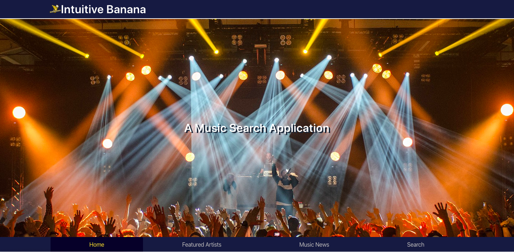

# IntuitiveBanana
First Project 

## Installation

No installation is necessary

## Purpose
The purpose of this project is to give the user an imersive music interaction; in that they can search artists, read music related news, find local concert and access tickets, and enjoy our fetured artists and songs. 

## Functionality

This page uses 3 different API's, Ticket Master, Audio DB and the New York Times to allow users to pull information about genre related news, fetured songs and artists, local concerts and search artist information by their name. Our three seperate API pulls allow us to offer a holistic user experience to music information. 

## Contributing

DeVante Baily, Javier Turner, Adam Wenger, and Cory Marshman. 

Other contributers: UNCC TA's

Audio DB : https://www.theaudiodb.com 
Ticketmaster : https://www.ticketmaster.com
New York Times : https://www.nytimes.com

Pull requests are welcome. For major changes, please open an issue first to discuss what you would like to change.

Please make sure to update tests as appropriate.

## Links

Page URL: 

Github Repo: https://github.com/DrBailey13/IntuitiveBanana/tree/master

Search Criteria : 
    Users are liked to artist's website and to https://www.youtube.com/

API's from : 
    Audio DB : https://www.theaudiodb.com/api_guide.php
    Ticketmaster : https://developer.ticketmaster.com/
    New York Times : https://developer.nytimes.com/

## Images

Favicon +++++++++++++++++++++++++++++++++++++

Logo ++++++++++++++++++++++++++++++++++++++++

Home Page ++++++++++++++++++++++++++++++++++

Featured Artist Page +++++++++++++++++++++++

Search +++++++++++++++++++++++++++++++++++++

Music-News +++++++++++++++++++++++++++++++++

## License
MIT License

Copyright (c) [2019] [Cory_Marshman/Devante_Baily/Javier_Turner/Adam_Wenger]

Permission is hereby granted, free of charge, to any person obtaining a copy of this software and associated documentation files (the "Software"),to deal in the Software without restriction, including without limitation the rights to use, copy, modify, merge, publish, distribute, sublicense, and/or sell copies of the Software, and to permit persons to whom the Software is furnished to do so, subject to the following conditions: The above copyright notice and this permission notice shall be included in all copies or substantial portions of the Software.

THE SOFTWARE IS PROVIDED "AS IS", WITHOUT WARRANTY OF ANY KIND, EXPRESS OR IMPLIED, INCLUDING BUT NOT LIMITED TO THE WARRANTIES OF MERCHANTABILITY, FITNESS FOR A PARTICULAR PURPOSE AND NONINFRINGEMENT. IN NO EVENT SHALL THE AUTHORS OR COPYRIGHT HOLDERS BE LIABLE FOR ANY CLAIM, DAMAGES OR OTHER LIABILITY, WHETHER IN AN ACTION OF CONTRACT, TORT OR OTHERWISE, ARISING FROM, OUT OF OR IN CONNECTION WITH THE SOFTWARE OR THE USE OR OTHER DEALINGS IN THE SOFTWARE.